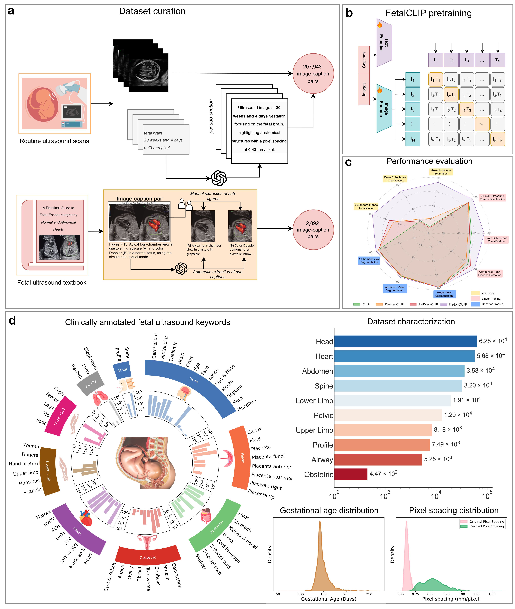

FetalCLIP 
===========
## A Visual-Language Foundation Model for Fetal Ultrasound Image Analysis

**Mohamed bin Zayed University of Artificial Intelligence (MBZUAI)** <br>
**Corniche Hospital, Abu Dhabi Health Services Company (SEHA)**

[](https://arxiv.org/abs/2502.14807)
[](https://biomedia-mbzuai.github.io/FetalCLIP/)

## 🍼 What is FetalCLIP

FetalCLIP is a vision-language foundation model designed specifically for fetal ultrasound image analysis. Unlike general-purpose models, FetalCLIP is pre-trained on 210,035 fetal ultrasound images paired with text, making it the largest dataset of its kind used for foundation model development. By leveraging multimodal learning, FetalCLIP generates universal representations of fetal ultrasound imagery. This innovative approach allows FetalCLIP to capture essential anatomical information, yielding robust representations that can be applied to a variety of clinically relevant downstream tasks.

## 📝 Highlights
> **Abstract:** *Foundation models are becoming increasingly effective in the medical domain, offering pre-trained models on large datasets that can be readily adapted for downstream tasks. Despite progress, fetal ultrasound images remain a challenging domain for foundation models due to their inherent complexity, often requiring substantial additional training and facing limitations due to the scarcity of paired multimodal data. To overcome these challenges, here we introduce FetalCLIP, a vision-language foundation model capable of generating universal representation of fetal ultrasound images. FetalCLIP was pre-trained using a multimodal learning approach on a diverse dataset of 210,035 fetal ultrasound images paired with text. This represents the largest paired dataset of its kind used for foundation model development to date. This unique training approach allows FetalCLIP to effectively learn the intricate anatomical features present in fetal ultrasound images, resulting in robust representations that can be used for a variety of downstream applications. In extensive benchmarking across a range of key fetal ultrasound applications, including classification, gestational age estimation, congenital heart defect (CHD) detection, and fetal structure segmentation, FetalCLIP outperformed all baselines while demonstrating remarkable generalizability and strong performance even with limited labeled data. We plan to release the FetalCLIP model publicly for the benefit of the broader scientific community.*
>


## 🏆 Contributions
- **Foundation Model:** We introduce FetalCLIP, the first-of-its-kind foundation model designed for fetal ultrasound image analysis, incorporating a large pretraining dataset of diverse image-text paired fetal ultrasound images.
- **Zero-Shot Performance:** FetalCLIP achieves outstanding zero-shot performance in fetal plane classification and gestational age estimation, while also effectively clustering fetal anatomical structures, potentially improving workflow efficiency in clinical practice.
- **Feature Extraction:** Our extensive evaluation demonstrates that FetalCLIP serves as a strong feature extractor for fetal ultrasound analysis.

## 📊 Benchmarks

| Model       | Zero-Shot: Fetal Planes Classification (F1-Score) | Zero-Shot: Brain Subplanes Classification (F1-Score) | Zero-Shot: GA Estimation (VPR) | Probing: Fetal Planes Classification (F1-Score) | Probing: Brain Subplanes Classification (F1-Score) | Probing: CHD Detection (F1-Score) | Probing: Segmentation - HC (DSC) | Probing: Segmentation - Abdomen View (DSC) | Probing: Segmentation - 4-Chamber View (DSC) |
|------------|--------------------------------|--------------------------------|-------------------|--------------------------------|--------------------------------|----------------------------|----------------|----------------|----------------|
| CLIP [[1]](https://github.com/openai/CLIP)       | 30.77                          | 20.61                          | 11.43             | 86.74                          | 63.42                          | 67.88                      | 97.70          | 79.42          | 70.22          |
| BiomedCLIP [[2]](https://ai.nejm.org/doi/full/10.1056/AIoa2400640) | 60.34                          | 23.62                          | 24.45             | 85.64                          | 58.20                          | 64.32                      | 97.73          | 78.79          | 70.09          |
| UniMed-CLIP [[3]](https://arxiv.org/abs/2412.10372) | 67.95                          | 18.75                          | 8.97              | 85.96                          | 60.67                          | 71.80                      | 97.84          | 80.12          | 69.27          |
| **FetalCLIP**  | **97.27**                        | **70.15**                        | **83.42**           | **94.73**                        | **82.01**                        | **78.72**                      | **97.92**        | **81.82**        | **72.91**        |


## 🔧 Installation

To set up the environment and install dependencies, follow these steps:

```bash
conda create -n fetalclip python=3.9
conda activate fetalclip
pip install -r requirements.txt
```

## 📥 Download FetalCLIP weights
The pretrained FetalCLIP model can be downloaded from the following link:

➡️ [Download FetalCLIP_weights.pt](https://mbzuaiac-my.sharepoint.com/:f:/g/personal/fadillah_maani_mbzuai_ac_ae/EspGREsyuOtEpxt36RoEUBoB6jtlsvPeoiDTBC1qX8WdZQ?e=uAbuyv)

## ⚡ Quick Start

```python
import json
import torch
import open_clip
from PIL import Image

# Define paths for model configuration and weights
PATH_FETALCLIP_CONFIG = "FetalCLIP_config.json"
PATH_FETALCLIP_WEIGHT = "FetalCLIP_weights.pt"

# Set device to GPU (CUDA) for faster computation
device = torch.device("cuda")

# Load and register model configuration
with open(PATH_FETALCLIP_CONFIG, "r") as file:
    config_fetalclip = json.load(file)
open_clip.factory._MODEL_CONFIGS["FetalCLIP"] = config_fetalclip

# Load the FetalCLIP model and preprocessing transforms as well as tokenizer
model, preprocess_train, preprocess_test = open_clip.create_model_and_transforms("FetalCLIP", pretrained=PATH_FETALCLIP_WEIGHT)
tokenizer = open_clip.get_tokenizer("FetalCLIP")
model.eval()
model.to(device)

# List of input image file paths
images = ["image1.jpg", "image2.png", ...] # Replace with actual image file paths
# Preprocess images and stack them into a single tensor
images = torch.stack([preprocess_test(Image.open(img_path)) for img_path in images]).to(device)

# Define text prompts for classification
text_prompts = [
    "Ultrasound image focusing on the fetal abdominal area, highlighting structural development.",
    "Fetal ultrasound image focusing on the heart, highlighting detailed cardiac structures.",
    ...
] # Please refer to the text prompts in zero_shot_planes_db/
text_tokens = tokenizer(text_prompts).to(device) # Tokenize the text prompts

# Perform model inference
with torch.no_grad(), torch.cuda.amp.autocast():
    # Encode text and images into feature vectors
    text_features = model.encode_text(text_tokens)
    image_features = model.encode_image(images)

    # Normalize feature vectors
    image_features /= image_features.norm(dim=-1, keepdim=True)
    text_features /= text_features.norm(dim=-1, keepdim=True)

    # Compute similarity scores (probabilities) between image and text features
    text_probs = (100.0 * image_features @ text_features.T).softmax(dim=-1)

print("Label probs:", text_probs)
```

## 🔄 Reproducibility
This repository includes scripts for evaluating and reproducing FetalCLIP results:

- **`zero_shot_planes_db/`**  
  Code for zero-shot classification of standard fetal ultrasound planes and brain subplanes.

- **`zero_shot_hc18/`**  
  Code for zero-shot gestational age estimation.

- **`probing/`**  
  Code for linear probing evaluations on classification and segmentation tasks.

- **`few_data_training/`**  
  Code for few-shot learning experiments using linear probing for classification and segmentation.

- **`cam/`**  
  Code for generating Class Activation Maps (CAM) visualizations.

- **`embeddings/`**  
  Code for extracting image embeddings using the FetalCLIP model.

## 🤝 Acknowledgements

We express our gratitude to Corniche Hospital in Abu Dhabi for providing prenatal scan data along with fetal heart scans, and to the Department of Health (DOH) Abu Dhabi for their support in approving the study which facilitates access to the anonymous data for internal purposes. We thank Alfred Z. Abuhamad for allowing us to leverage his book for foundation model pretraining. We also thank GE Healthcare for providing data and annotations used for downstream segmentation tasks in the 4-chamber and abdomen views.

## ✒️ Citation

```bibtex
@article{maani2025fetalclipvisuallanguagefoundationmodel,
      title={FetalCLIP: A Visual-Language Foundation Model for Fetal Ultrasound Image Analysis},
      author={Maani, Fadillah and Saeed, Numan and Saleem, Tausifa Jan and Farooq, Zaid and Alasmawi, Hussain and Diehl, Werner and Mohammad, Ameera and Waring, Gareth and Valappil, Saudabi and Bricker, Leanne and Yaqub, Mohammad},
      journal={arXiv preprint arXiv:2502.14807},
      year={2025}
    }
}
```